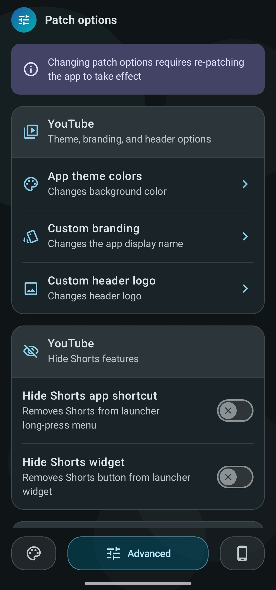
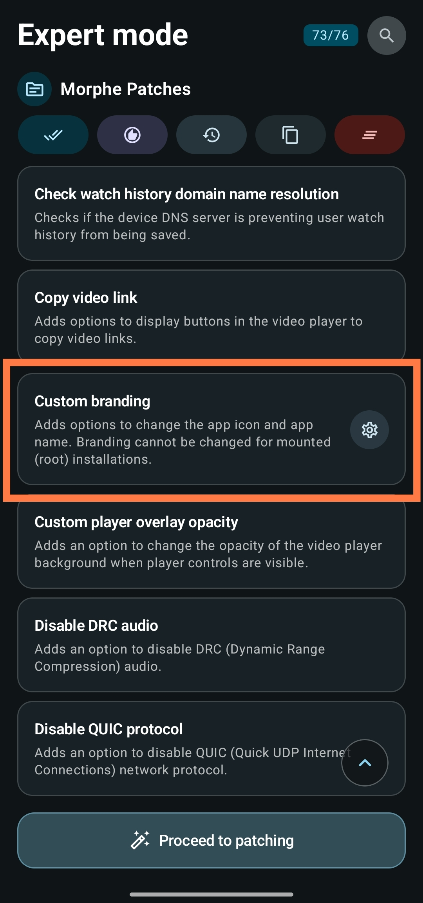
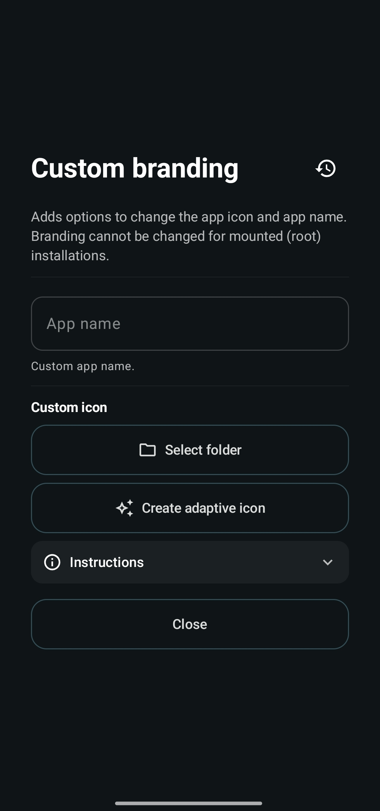
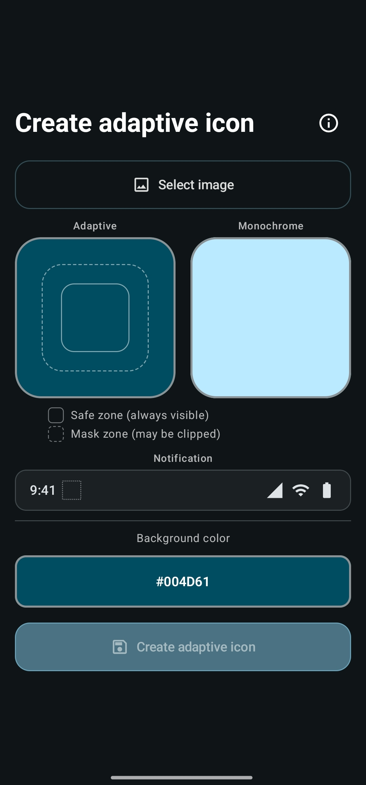
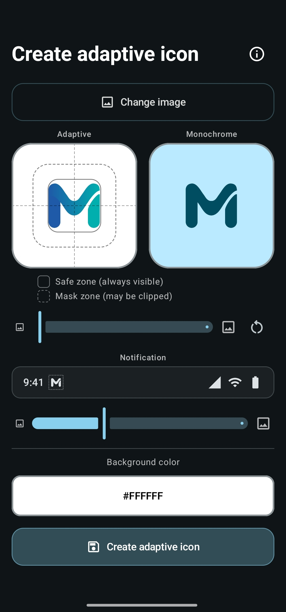
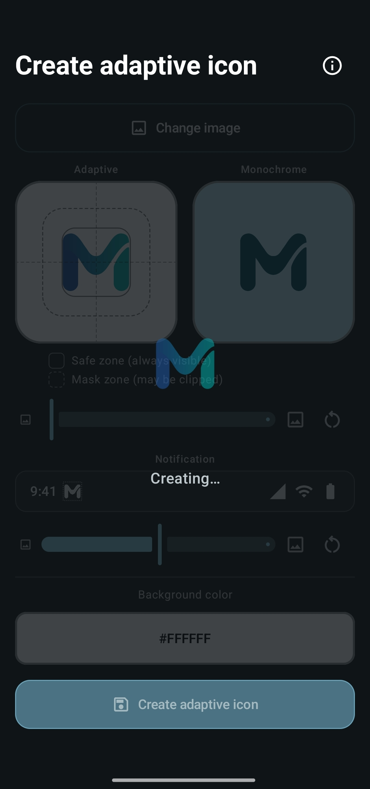
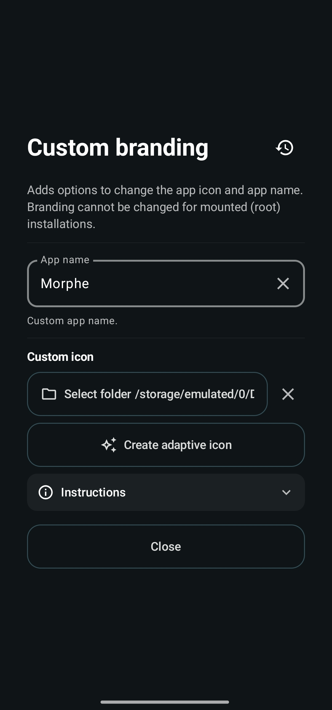
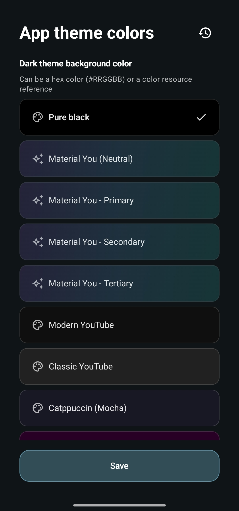

# Creating a custom app icon

The **Custom branding** patch lets you replace the patched app's launcher icon and display
name. Morphe includes an icon creator that turns a single image into a complete adaptive
icon set, so you do not have to prepare density folders by hand.

Where the branding options live depends on your mode, the icon creator itself is identical
in both.

> [!IMPORTANT]
> Branding cannot be changed for mounted (root) installations. Custom icons and names only
> apply to regular installs, see [Root mount](installers.md#root-mount-in-detail).

> [!NOTE]
> Changing these options requires re-patching the app to take effect. Set them up first,
> then patch.

## Where to find the branding options

### Simple mode

Open **Settings → Advanced → Patch options**, then the app you want to customize.
**Custom branding** is in that list.

  

### Expert mode

Branding lives with the patches instead. On the patch selection screen, find **Custom
branding**, make sure the patch is enabled, and tap the settings icon on its card.

  

## The Custom branding dialog

Both routes open a dialog with the same contents. The Expert mode version is shown here.

  

- **App name** - the display name shown under the launcher icon and in the app list. Leave
  it empty to keep the original name. Anything goes, and a name like `YouTube Morphe` makes
  the patched build easy to tell apart from a Play Store one. The X clears the field.
- **Select folder** - points the patch at a folder that already contains a prepared icon
  set. Use this if you made the icons yourself or want to reuse a set from an earlier patch.
  Once a folder is set, the button shows its path and an X next to it clears the selection.
- **Create adaptive icon** - opens the icon creator described below. This is the easy route,
  it builds the whole folder structure for you and fills in the path automatically.
- **Instructions** - expands the exact folder layout, file names, and pixel sizes required
  if you prepare the icons manually.
- The **restore** icon in the dialog header resets these options back to their defaults.

The one difference between the modes is how changes are committed. In Simple mode the dialog
has **Save** and **Cancel** buttons and nothing is stored until you tap **Save**. In Expert
mode the values apply as you set them and **Close** simply dismisses the dialog.

## Preparing your image

The icon creator needs one image, and the requirements matter:

> [!IMPORTANT]
> **Use a PNG with a transparent background.** Only the artwork itself should be opaque,
> everything around it must be transparent. Morphe warns you when the image you pick has no
> transparent pixels at all, because the result will almost certainly look wrong.

The background is not part of your image. It is a separate solid color you choose with the
color picker in the dialog, and that is how Android adaptive icons work: a foreground layer
and a background layer that the launcher moves and masks independently.

> [!NOTE]
> A fully transparent icon background is not possible. Modern launchers do not support it,
> every adaptive icon gets a background layer, so pick a color that suits your artwork.

## Creating the icon

Tap **Create adaptive icon** and the creator opens with two live previews: **Adaptive**, the
launcher icon, and **Monochrome**, the themed version Android 13 and later tints with the
wallpaper accent color.

  

### 1. Select the image

**Select image** opens the picker. Choose your transparent PNG, and both previews update
immediately.

### 2. Position and scale it

  

Drag the artwork inside the adaptive preview to move it, pinch to zoom, or use the slider
below the previews. The reset button next to the slider appears once you change anything and
puts position and scale back to the defaults.

The two dashed outlines on the preview are guides:

- **Safe zone (solid)** - always fully visible, whatever shape the launcher uses. Keep the
  important parts of your artwork inside it.
- **Mask zone (dashed)** - may be clipped depending on the launcher's icon shape.

The monochrome preview follows the same position and scale, so you only adjust once.

### 3. Set the notification icon size

The **Notification** row previews your icon in the status bar, with its own slider. Status
bar icons are drawn as a flat silhouette, so everything visible there appears white
regardless of your colors.

### 4. Choose the background color

**Background color** opens a color picker with a hex field. This is the color behind your
transparent foreground, and it fills the entire icon, including the parts the launcher mask
crops away.

### 5. Create

Tap **Create adaptive icon** and pick a folder to save into. Morphe writes the icon set
there while showing a **Creating...** overlay.

  

Inside the folder you choose, Morphe creates `morphe_branding/morphe_icons_youtube` (or
`morphe_icons_music` for YouTube Music) containing every density variant of the foreground
and background, the monochrome layer, and the notification icons. A `.nomedia` file is added
so the pieces do not show up in your gallery.

## Done

The dialog closes and the path to the generated folder is filled into the icon field
automatically, so the patch is ready to use. Fill in **App name** as well if you want a
custom display name.

  

In Simple mode, tap **Save** before leaving. Then patch the app, and the new icon and name
are applied. To reuse the same icon later, point the folder field at that folder again, the
files stay where you saved them.

## Preparing icons manually

If you would rather build the set yourself, **Select folder** accepts any folder with the
correct layout. Tap **Instructions** in the branding dialog for the authoritative list, the
short version is:

- `mipmap-mdpi` through `mipmap-xxxhdpi`, each with
  `morphe_adaptive_background_custom.png` and `morphe_adaptive_foreground_custom.png`
- Sizes per density: 108, 162, 216, 324, and 432 px square
- Optionally `drawable/morphe_adaptive_monochrome_custom.xml` for the themed icon
- Optionally a notification icon, either `drawable/morphe_notification_icon_custom.xml` or
  PNGs in the `drawable-*dpi` folders at 24, 36, 48, 72, and 96 px

Only the densities your device actually uses are required, but including all of them keeps
the set portable.

## Other branding options in the same place

The **Custom branding** dialog is one of several appearance options for the patched app:

  

- **App theme colors** - the background color of the patched app, as a preset such as Pure
  black, Material You, or Catppuccin, or your own hex value for the dark and light themes.
- **Custom header logo** - replaces the logo in the app's header, see
  [Creating a custom header logo](custom-header-logo.md).

All of them need a re-patch to take effect.

## Troubleshooting

| Problem | What to do |
| --- | --- |
| "Image has no transparent pixels" warning | Your PNG has a solid background baked in. Remove it, or the background color you pick will never be visible |
| The icon looks cropped in the launcher | Artwork extends past the safe zone. Reopen the creator and scale it down |
| The icon did not change after installing | Patch options only apply when the app is patched again. Re-patch with the option set |
| Branding does not apply at all | Mounted (root) installations cannot change branding. Patch in [standard install mode](installers.md#choosing-the-mode) instead |
| The notification icon is a white blob | Status bar icons are silhouettes. Use artwork with clear cutouts instead of a solid shape |

## Next steps

- [Patching an app in Simple mode](patching-simple-mode.md)
- [Patching an app in Expert mode](patching-expert-mode.md)
