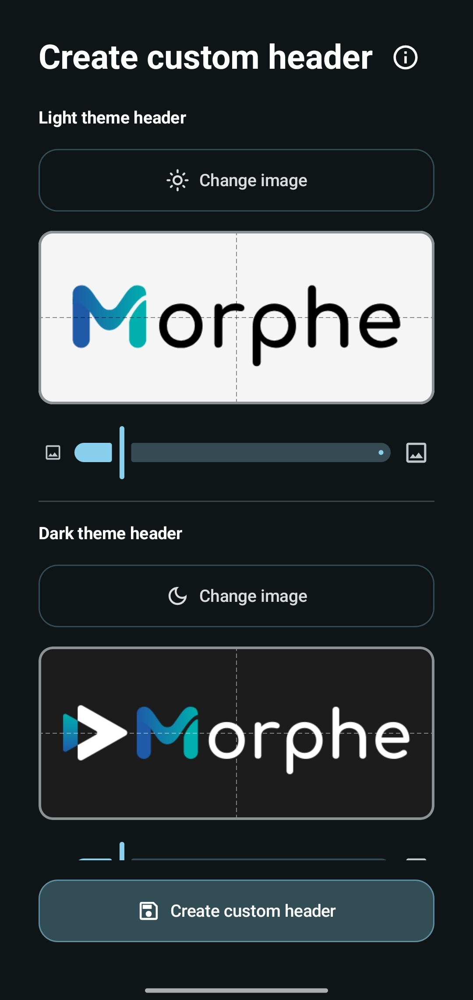

# Creating a custom header logo

The header logo is the branding at the top of the patched app, where YouTube shows its
wordmark. Morphe can replace it with your own image, and includes a creator that builds the
required density folders for you.

The flow mirrors [Creating a custom app icon](custom-app-icon.md), only the creator dialog
differs.

> [!NOTE]
> Changing this option requires re-patching the app to take effect.

## Where to find it

- **Simple mode** - **Settings → Advanced → Patch options**, then the app, then **Custom
  header logo**.
- **Expert mode** - on the patch selection screen, find the header patch, make sure it is
  enabled, and tap the settings icon on its card.

Both open a dialog with a folder field, a **Create custom header** button, and expandable
**Instructions** with the exact layout required for a folder you prepare yourself.

## Preparing your images

- **Any PNG or JPEG works.** A PNG with a transparent background blends naturally with the
  app's own theme.
- **Use a wide image.** Roughly a 2.7:1 aspect ratio matches the space the header occupies.
- **You usually need two.** Most apps use a separate logo for the light and the dark theme.
  Apps that only have a dark theme, such as YouTube Music, show a single section.

## Creating the header

Tap **Create custom header**.

  

Each theme has its own **Change image** button, a live preview, and a scale slider:

1. Pick the image for **Light theme header**.
2. Drag it inside the preview to position it, pinch to zoom, or use the slider. Dashed snap
   guides appear when the image is near the center.
3. Repeat for **Dark theme header**.
4. Tap **Create custom header** and choose a folder to save into.

The info icon in the dialog header opens the same guidance in the app.

Morphe writes `morphe_branding/morphe_header_youtube` (or `morphe_header_music` for YouTube
Music) inside the folder you picked, containing a `drawable-hdpi` through `drawable-xxxhdpi`
set of `morphe_header_custom_light.png` and `morphe_header_custom_dark.png`, plus a
`.nomedia` file so the pieces stay out of your gallery. The path is filled into the option
automatically.

In Simple mode, tap **Save** before leaving the dialog. Then patch the app.

## Preparing images manually

**Select folder** accepts any folder with the right layout. Tap **Instructions** for the
authoritative list, the short version is:

- `drawable-hdpi`, `drawable-xhdpi`, `drawable-xxhdpi`, and `drawable-xxxhdpi`, each with
  `morphe_header_custom_light.png` and `morphe_header_custom_dark.png`
- Sizes per density: 194x72, 258x96, 387x144, and 512x192 px

## Troubleshooting

| Problem | What to do |
| --- | --- |
| The logo looks stretched or cropped | The source image is not wide enough. Use something close to 2.7:1 |
| The logo has a visible box around it | Use a PNG with a transparent background instead of a JPEG |
| Only one theme section is shown | That app only uses a single header, which is expected for YouTube Music |
| The header did not change after installing | Patch options only apply when the app is patched again |

## Next steps

- [Creating a custom app icon](custom-app-icon.md)
- [Patching an app in Expert mode](patching-expert-mode.md)
