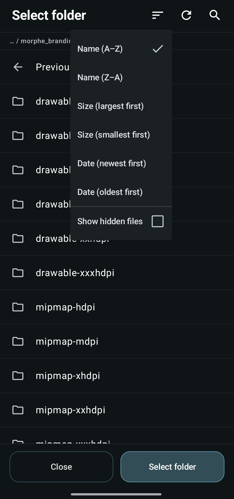

# Using the built-in file picker

Morphe uses Android's own file picker by default. If that picker hides your Downloads
folder, refuses to open an APK, or simply gets in your way, Morphe has its own browser that
reads storage directly.

## Turning it on

**Settings → System → Files & storage → Custom file picker**. From then on, every place that
asks for a file or a folder, selecting an APK, importing a keystore, or pointing a patch at
an icon folder, opens Morphe's picker instead.

## Browsing

  

The path along the top shows where you are, and **Previous directory** goes back up. Morphe
offers the usual entry points: **Internal storage**, **SD card**, and **Root (/)**.

The three actions in the header are:

- **Sort** - **Name (A-Z)** or **(Z-A)**, **Size** largest or smallest first, and **Date**
  newest or oldest first. The same menu holds **Show hidden files**, for folders and files
  starting with a dot.
- **Refresh** - re-reads the current directory.
- **Search** - filters what is listed.

## Picking

What the picker returns depends on what asked for it:

- **A file** - tap it, for example the APK you downloaded or a keystore you exported.
- **A folder** - navigate into the folder you want and tap **Select folder** at the bottom.
  This is what the branding options use, see
  [Creating a custom app icon](custom-app-icon.md).

**Close** cancels without selecting anything.

## Troubleshooting

| Problem | What to do |
| --- | --- |
| "Cannot read this directory" | Android restricts some paths. Move the file somewhere accessible, such as the root of internal storage |
| "No files here" but you expect files | The folder may hold only hidden entries. Enable **Show hidden files** in the sort menu |
| Your file does not show up | The picker filters by what the caller asked for. Check you are looking for the right file type |

## Next steps

- [Patching an app in Simple mode](patching-simple-mode.md)
- [Backing up Morphe and your keystore](backup-and-keystore.md)
